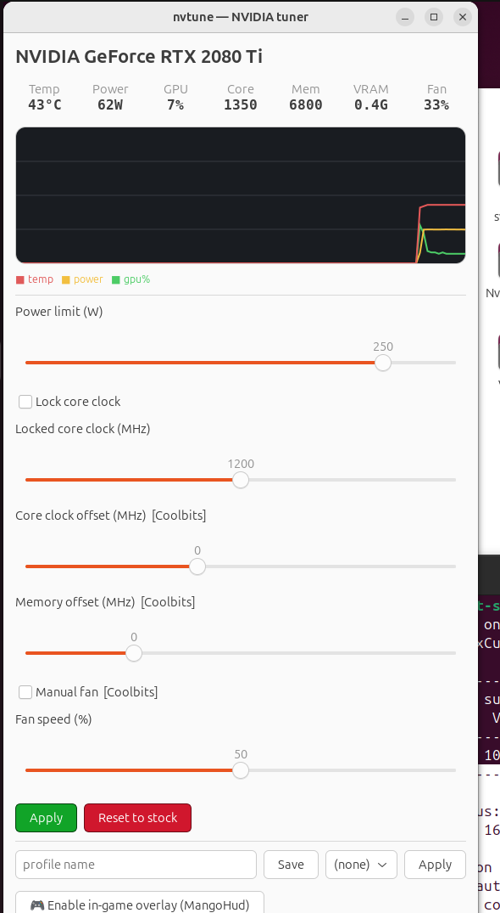

# ⚡ nvtune

A small **MSI-Afterburner-style** tool for **NVIDIA GPUs on Linux** — undervolt, live monitoring, tuning profiles, and an in-game overlay.

> 🇻🇳 **Tiếng Việt bên dưới** — [nhảy tới](#-tiếng-việt)



```
$ nvtune monitor
              nvtune — NVIDIA live monitor
 GPU            Temp   Power     GPU%  Core clk   VRAM     Fan
 0 GeForce 2080 43°C   62/250W   12%   1350/2100  0.4/22G  35%
```

Comes in two flavours: a **graphical tuner** (`nvtune-gui`, GTK4 — sliders, live graph, Apply/Reset) and a **CLI/TUI** (`nvtune`) for terminals and scripting.

## Features

* **GUI** (`nvtune-gui`) — Afterburner-style window: live readouts + rolling graph, a **drag-to-set clock/voltage curve** panel, sliders for power/clock/offsets/fan, Apply/Reset, profiles, overlay toggle
* **monitor** — live TUI dashboard (temp, power, clocks, util, VRAM, fan)
* **undervolt / set** — power limit, GPU-clock lock, clock & memory offsets, fan
* **reset** — revert everything to stock
* **profile** — save / apply / list named tuning profiles
* **autostart** — apply a profile at every boot (systemd)
* **osd** — in-game overlay (FPS + GPU/CPU/temp/clock/power) via [MangoHud](https://github.com/flightlessmango/MangoHud)

## About "undervolting" on Linux + NVIDIA

The NVIDIA Linux driver exposes **no voltage curve** (unlike Afterburner on Windows). The effective undervolt is to **lock the GPU clock** (`nvidia-smi -lgc`) and **cap the power limit** (`-pl`): the GPU then runs that clock at the lowest voltage it needs. An optional positive **clock offset** (applied through NVML) lets the same voltage reach a higher clock. `nvtune` wraps all of this behind simple commands.

## Install

```sh
git clone https://github.com/windystrife/nvtune
cd nvtune && ./install.sh          # installs to /usr/local/bin + deps (python3-rich, mangohud)
```
Requirements: an NVIDIA GPU with the proprietary driver (`nvidia-smi`), Python 3, and `sudo` for applying clock/power settings.

## Usage

```sh
nvtune-gui                                      # graphical tuner (or launch "nvtune" from the app menu)

nvtune monitor                                  # live dashboard (Ctrl-C to quit)

# Undervolt: lock the core clock and cap power (the Linux undervolt)
nvtune undervolt --clock 1800 --power 220

# Fine control
nvtune set --power 200 --lock-clock 300,1800    # power + clock range
nvtune set --gpu-offset 100 --mem-offset 400    # clock offsets (via NVML)
nvtune reset                                    # back to stock

# Profiles
nvtune profile save silent --power 180 --lock-clock 300,1500
nvtune profile apply silent
nvtune profile list
nvtune autostart silent                         # apply 'silent' at every boot

# In-game overlay (MangoHud)
nvtune osd install                              # install + write overlay config
nvtune osd run -- <game/launcher>               # launch a game with the overlay
# Steam launch options:  mangohud %command%     (toggle with Shift_R+F12)
```

Multiple GPUs: add `-i <index>` (e.g. `nvtune -i 1 monitor`).

## Notes

* **Clock offsets & fan control** go through **NVML** (`libnvidia-ml`, which ships with the driver): no X server, no `Coolbits` and **no attached display** — they work on a fully headless box. They do need root, which `nvtune` takes via `sudo`. `nvidia-settings` is kept only as a fallback for drivers too old to expose the NVML setters — beware that distros often ship an `nvidia-settings` far older than the driver (510 vs 595 here), and that mismatch makes its writes fail with a bare `Unknown Error`.
* Locking clocks / power limits needs root — `nvtune` calls `sudo` automatically.
* Always test tuning under load and revert with `nvtune reset` if unstable.

---

<a id="-tiếng-việt"></a>
# 🇻🇳 Tiếng Việt

Tool nhỏ kiểu **MSI Afterburner** cho **GPU NVIDIA trên Linux** — undervolt, xem thông số live, lưu profile, và OSD hiện thông số trong game.

Có 2 dạng: **GUI đồ hoạ** (`nvtune-gui`, GTK4 — slider, đồ thị live, Apply/Reset) và **CLI/TUI** (`nvtune`) cho terminal/script.

## Tính năng

* **GUI** (`nvtune-gui`) — cửa sổ kiểu Afterburner: readout live + đồ thị, **curve clock/voltage kéo được** (kéo = đặt lock clock), slider power/clock/offset/quạt, Apply/Reset, profile, bật OSD
* **monitor** — bảng TUI live (nhiệt độ, điện, clock, tải, VRAM, quạt)
* **undervolt / set** — power limit, khoá clock GPU, offset clock & mem, quạt
* **reset** — về stock
* **profile** — lưu / nạp / liệt kê profile
* **autostart** — tự áp profile mỗi lần boot (systemd)
* **osd** — overlay trong game (FPS + GPU/CPU/nhiệt/clock/điện) qua [MangoHud](https://github.com/flightlessmango/MangoHud)

## Về "undervolt" trên Linux + NVIDIA

Driver NVIDIA Linux **không cho chỉnh đường cong điện áp** (khác Afterburner Windows). Cách undervolt hiệu quả: **khoá clock GPU** (`nvidia-smi -lgc`) + **giới hạn power** (`-pl`) → GPU chạy clock đó ở điện áp thấp nhất nó cần. Thêm **clock offset** dương (áp qua NVML) để cùng điện áp đạt clock cao hơn. `nvtune` gói tất cả vào lệnh gọn.

## Cài đặt

```sh
git clone https://github.com/windystrife/nvtune
cd nvtune && ./install.sh          # cài vào /usr/local/bin + deps (python3-rich, mangohud)
```
Yêu cầu: GPU NVIDIA driver proprietary (`nvidia-smi`), Python 3, và `sudo` để áp clock/power.

## Cách dùng

```sh
nvtune monitor                                  # bảng live (Ctrl-C thoát)

# Undervolt: khoá core clock + cap power
nvtune undervolt --clock 1800 --power 220

# Chỉnh chi tiết
nvtune set --power 200 --lock-clock 300,1800
nvtune set --gpu-offset 100 --mem-offset 400    # offset (qua NVML)
nvtune reset                                    # về stock

# Profile
nvtune profile save silent --power 180 --lock-clock 300,1500
nvtune profile apply silent
nvtune autostart silent                         # tự áp mỗi lần boot

# OSD trong game (MangoHud)
nvtune osd install
nvtune osd run -- <game>
# Steam: đặt launch option  mangohud %command%   (bật/tắt: Shift_R+F12)
```

Nhiều GPU: thêm `-i <index>`.

## Lưu ý

* **Clock offset & quạt** chạy qua **NVML** (`libnvidia-ml`, đi kèm driver): không cần X server, không cần `Coolbits`, **không cần cắm màn hình** — chạy được trên máy headless. Chỉ cần root (nvtune tự gọi `sudo`). `nvidia-settings` chỉ còn là fallback cho driver quá cũ — lưu ý distro hay ship `nvidia-settings` cũ hơn driver rất nhiều (510 vs 595 ở đây), lệch version làm mọi lệnh ghi fail với `Unknown Error`.
* Khoá clock/power cần root — `nvtune` tự gọi `sudo`.
* Luôn test khi có tải, không ổn thì `nvtune reset`.
